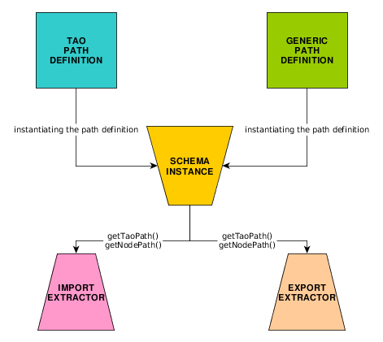

# extension-tao-lom
An extension enabling LOM Metadata support for Assessment Content resources

## Definitions

### Metadata service
It defines the services which are in charge for metadata import/export processes.

#### Import services
It defines the services which are in charge for metadata import processes.

##### Extractor services
It defines the services which can extract the metadata from the importable xml files.

##### Injector services
It defines the services which can inject the extracted metadata to the database.

##### Guardian services
It defines the services which can avoid from database duplications.


#### Export services
It defines the services which are in charge for metadata export processes.

##### Extractor services
It defines the services which can extract the metadata from the exportable database.

##### Injector services
It defines the services which can inject the extracted metadata to the xml files.

***

### Path definition service
It defines the services which are in charge to define the metadata place in the TAO system and in the xml files.

#### TAO path definition service
It defines the place of each metadata node in the TAO system based on the implemented rules.

#### Generic path definition service
It defines the place of each metadata node in the xml files based on the implemented standard.

***

### Schema service
It defines the services which are in charge to define the metadata structure.

#### Schema instance
It's a definition of a node. It contains the structure in the xml file and contains the place in the TAO system.
The structure is based the defined vocabulary in the [Generic path definition service](#generic-path-definition-service).
The place in the TAO system is defined in the [TAO path definition service](#tao-path-definition-service).

##### Auto processable schema instance
It's a schema instance which can be processed by the unified export/import solutions.  
*(for example: General elements)*

##### Custom processable schema instance
It's a schema instance which cannot be processed with the unified export/import solutions. It needs custom extractors/injectors to process the instance.  
*(for example: Classification elements)*

## Structure
### Import process


### Export process


### Schema system


## Implementation

### TAO path definition service
It needs to implement the ```LomTaoPathDefinition``` interface.

### Generic path definition service
It needs to implement the ```LomGenericPathDefinition``` interface.

### Schema instance example
It needs to implement the ```LomSchemaInterface``` interface.
```php
namespace oat\taoLom\model\schema\imsglobal\general;


use oat\taoLom\model\schema\LomSchemaAbstract;

class LomGeneralTitleSchema extends LomSchemaAbstract
{
    /**
     * Get the default general node path
     *
     * @return array
     */
    public function getBaseNodePath()
    {
        return array(
            $this->genericPathDefinition->getLomPath(),
            $this->genericPathDefinition->getGeneralPath(),
        );
    }

    /**
     * Get the general title node's relative path.
     *
     * @return array
     */
    public function getNodeRelativePath()
    {
        return [
            $this->genericPathDefinition->getTitlePath(),
            $this->genericPathDefinition->getStringPath(),
        ];
    }

    /**
     * Get the general title node's extract path.
     *
     * @return array
     */
    public function getNodePath()
    {
        return $this->getNodeAbsolutePath();
    }

    /**
     * Returns the general title place in the TAO system.
     *
     * @return string
     */
    public function getTaoPath()
    {
        return $this->taoPathDefinition->getGeneralTitle();
    }
}
```
