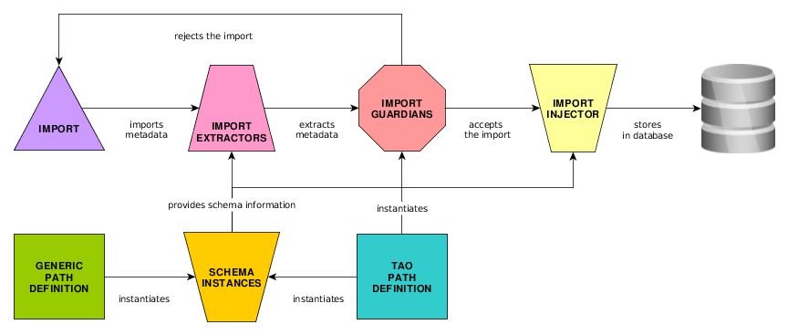

# extension-tao-lom
An extension enabling LOM Metadata support for Assessment Content resources

***

## LOM (Learning Object Metadata)
Learning Object Metadata is a data model, usually encoded in XML, used to describe a learning object 
and similar digital resources used to support learning. The purpose of learning object metadata is to 
support the reusability of learning objects, to aid discoverability, and to facilitate their 
interoperability, usually in the context of online learning management systems (LMS). [1]  
  
### Useful links
* [IMS Learning Resource Meta-data Specification](https://www.imsglobal.org/metadata/index.html)  
* [IMS Meta-data Best Practice Guide](https://www.imsglobal.org/metadata/mdv1p3/imsmd_bestv1p3.html)

***

## Definitions

### Metadata service
It defines the services which are in charge for metadata import/export processes.

#### Import services
It defines the services which are in charge for metadata import processes.

##### Extractor services
It defines the services which can extract the metadata from the importable xml files.

##### Injector services
It defines the services which can inject the extracted metadata to the database.

##### Guardian services
It defines the services which can avoid from database duplications.


#### Export services
It defines the services which are in charge for metadata export processes.

##### Extractor services
It defines the services which can extract the metadata from the exportable database.

##### Injector services
It defines the services which can inject the extracted metadata to the xml files.

***

### Path definition service
It defines the services which are in charge to define the metadata place in the TAO system and in the xml files.

#### TAO path definition service
It defines the place of each metadata node in the TAO system based on the implemented rules.

#### Generic path definition service
It defines the place of each metadata node in the xml files based on the implemented standard.

***

### Schema service
It defines the services which are in charge to define the metadata structure.

#### Schema instance
It's a definition of a node. It contains the structure in the xml file and contains the place in the TAO system.
The structure is based the defined vocabulary in the [Generic path definition service](#generic-path-definition-service).
The place in the TAO system is defined in the [TAO path definition service](#tao-path-definition-service).

##### Auto processable schema instance
It's a schema instance which can be processed by the unified export/import solutions.  
*(for example: General elements)*

##### Custom processable schema instance
It's a schema instance which cannot be processed with the unified export/import solutions. It needs custom extractors/injectors to process the instance.  
*(for example: Classification elements)*

***

## Structure
### Import process


***

### Export process


***

### Schema system


***

## Directory structure
* *docs*: rendered images and their source files
* *install*: the ontology rdf files
* *model*: 
  * *export*: the export related classes
    * *extractor*: the export extractors
    * *injector*: the export injectors
  * *import*: the import related classes
    * *extractor*: the import extractors
    * *guardian*: the import guardians
    * *injector*: the import injectors
  * *ontology*: the path definitions
  * *schema*: the implemented schema folders
    * *imsglobal*: the ims global standard lom implementation
  * *service*: the path definition and schema services
* *scripts*: the install/update scripts
  * *install*: the service install scripts with the default configuration
  * *update*: the service update scripts and the updater script

***

## Implementation

### New ImportExtractor
It needs to extend the ```ImsManifestMetadataExtractor``` because of the manifest extraction.
```php
<?php
use oat\taoQtiItem\model\qti\metadata\imsManifest\ImsManifestMetadataExtractor;

class LomAutoProcessableSchemaImportExtractor extends ImsManifestMetadataExtractor
{
    public function extract($manifest)
    {
        $values = parent::extract($manifest);
        $metadata = [];
        
        foreach ($values as $resourceIdentifier => $metadataValueCollection) {
            /**
             * @TODO: do the logic on the values!
             *
             * @example: $metadata[$resourceIdentifier][] = new SimpleMetadataValue(...);
             */
        }
        
        return $metadata;
    }
}
```

### New ImportGuardian
It needs to implement the ```MetadataGuardian``` interface. The ```guard()``` method needs to return false
when the element is injectable. If it's not it returns the ```\core_kernel_classes_Resource``` instance of the element.

### New ImportInjector
It needs to implement the ```MetadataInjector``` interface. The default injector is quite flexible so it should do 
the job in most of the cases.

### New ExportExtractor
It needs to implement the ```MetadataExtractor``` interface. It's recommended to use the 
```LomExportExtractorAbstract``` class.
```php
<?php
use oat\taoLom\model\export\extractor\LomExportExtractorAbstract;
use oat\taoQtiItem\model\qti\metadata\MetadataExtractionException;

class LomAutoProcessableSchemaExportExtractor extends LomExportExtractorAbstract
{
    public function extract($resource)
    {
        if (! $resource instanceof \core_kernel_classes_Resource) {
            throw new MetadataExtractionException(__('The given target is not an instance of core_kernel_classes_Resource'));
        }
        
        $metadata = [];

        /**
         * @TODO: Extract the metadata!
         * 
         * @example: $metadata[] = new SimpleMetadataValue(...);
         */

        return $this->getExtractOutput($resource, $metadata);
    }
}
```

### New ExportInjector
It needs to extend the ```ImsManifestMetadataInjector``` class for being able to process the injection.
The default injector is quite flexible so it should do the job in most of the cases.

### New TAO path definition service
It needs to implement the ```LomTaoPathDefinition``` interface.

### New Generic path definition service
It needs to implement the ```LomGenericPathDefinition``` interface.

### New Schema instance
It needs to implement the ```LomSchemaInterface``` interface. It's recommended to extend the 
```LomSchemaAbstract``` abstract class which already contains some basic logic.

***

## Install services

### Install MetadataServices
Just simply need to change the ```scripts/install/InstallLomMetadataService.php``` file's instantiation parameters.

### Install PathDefinitionServices
Just simply need to change the ```scripts/install/InstallLomPathDefinitionService.php``` file's instantiation parameters.

### Install SchemaServices
Just simply need to change the ```scripts/install/InstallLomSchemaService.php``` file's instantiation parameters.

***

## Update services

### Update MetadataServices
```php
<?php
if ($this->isVersion('a.b.c')) {
    $lomMetadataServices = new AddLomMetadataService();
    $lomMetadataServices->setServiceLocator($this->getServiceManager());
    $lomMetadataServices([
        MetadataService::IMPORTER_KEY => [
            MetadataImporter::INJECTOR_KEY => [
                // Class name list,
            ],
            MetadataImporter::EXTRACTOR_KEY => [
                // Class name list,
            ],
            MetadataImporter::GUARDIAN_KEY => [
                // Class name list,
            ],
        ],
        MetadataService::EXPORTER_KEY => [
            MetadataExporter::INJECTOR_KEY => [
                // Class name list,
            ],
            MetadataExporter::EXTRACTOR_KEY => [
                // Class name list,
            ],
        ],
    ]);

    $this->setVersion('e.f.d');
}
```

### Update PathDefinitionServices
```php
<?php
if ($this->isVersion('a.b.c')) {
    $lomSchemaService = new AddLomSchemaService();
    $lomSchemaService->setServiceLocator($this->getServiceManager());
    $lomSchemaService([
        LomSchemaService::AUTOMATIC_PROCESSABLE_INSTANCES => [
                // Class name list,
        ],
        LomSchemaService::CUSTOM_PROCESSABLE_INSTANCES => [
                // Class name list,
        ],
    ]);

    $this->setVersion('e.f.d');
}
```

### Update SchemaServices
```php
<?php
if ($this->isVersion('a.b.c')) {
    $lomPathDefinitionServices = new AddLomPathDefinitionService();
    $lomPathDefinitionServices->setServiceLocator($this->getServiceManager());
    $lomPathDefinitionServices([
        LomPathDefinitionService::LOM_TAO_PATH_DEFINITION_KEY     => 'Class name',
        LomPathDefinitionService::LOM_GENERIC_PATH_DEFINITION_KEY => 'Class name',
    ]);

    $this->setVersion('e.f.d');
}
```

[1]: https://en.wikipedia.org/wiki/Learning_object_metadata "wikipedia.org"
